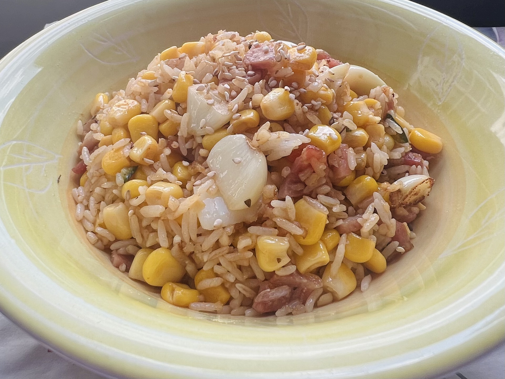

# 个人日志
这是一个用来记录我大学生活的日志！

## 2025年6月15日
今天是第一天，我还在和Github搏斗。我感觉它虽然不复杂但是很容易出问题。以下是我这今天做的菜。
#### 玉米炒培根炒大蒜炒饭，好吃的

#### 山姆的速食咖喱+饭，略咸，不过很方便

#### 非常地道的老伦敦炸鱼，这个就不是我做的而是是在食堂吃的了，今天蔬菜吃得有点少。

上周我去附近步行十分钟到的社区花园做了义工，从上午十点起在那帮忙给肥料过筛、给植物浇水、把茶叶的盆栽移植到花圃里，待到午饭吃完就回宿舍了。那里有许多和我一样放暑假的大学生在做义工，我认识了不少人。
#### 这是我当时在浇水的照片，地里边是上周才种下的南瓜和向日葵，围绕着南瓜种的是西红柿。听负责人说今年夏天可以收获西红柿，到了九月份就可以收南瓜了。

#### 花园的午餐还挺多样的，而且有不少蔬菜。左下角是菠菜和鹰嘴豆，右上角是土豆。除此之外还有蔬菜沙拉和面包吃，吃完一盘后还能多打一点。当时我因为筛肥料太耗体力了就吃了不少。味道很丰富。

总之这一周我过的很充实，也很开心！
